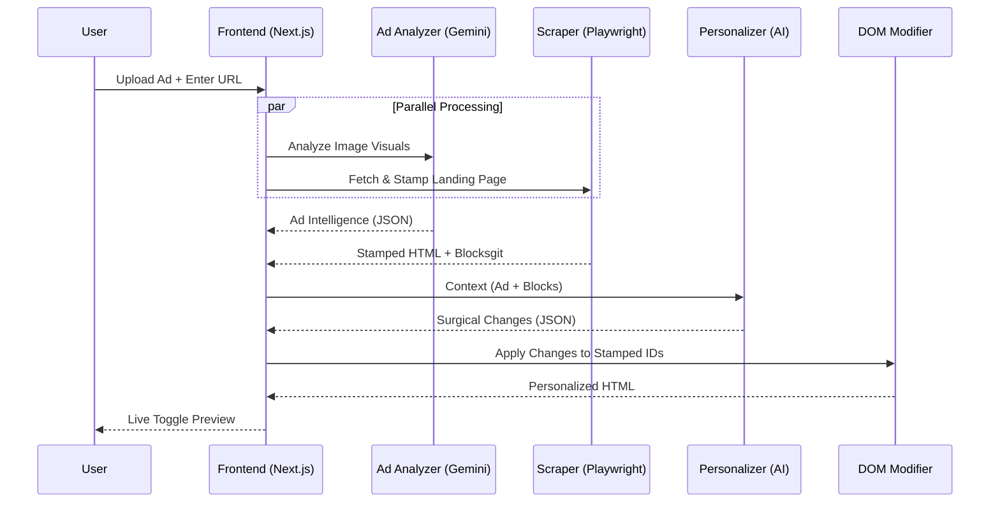

#  Troopod AI: Ad-to-Landing-Page Personalization Engine

Troopod AI is a high-performance personalization engine designed to bridge the gap between ad creatives and landing pages. It analyzes ad visuals using Gemini Vision and surgically modifies the landing page DOM to ensure "Message Match" and "Scent Trail" continuity, significantly boosting conversion rates (CRO).

##  Key Features

-   **AI Ad Vision Analysis**: Uses Google Gemini 2.5 Flash to extract headlines, CTAs, tone, and color palettes from ad images.
-   **Intelligent DOM Scraping**: Uses Playwright to fetch live landing page content, with a custom parser that identifies semantic blocks (headlines, features, CTAs).
-   **Deterministic ID Stamping**: Injects temporary `data-tp-id` attributes to guarantee 100% reliable element targeting, bypassing fragile CSS selectors or hashed class names.
-   **Surgical Personalization**: AI-driven modifications that respect navigation and footer areas while aligning hero headlines and primary CTAs with the ad's promise.
-   **Interactive Preview**: A dual-view toggle system allows users to flip between the original and personalized landing page versions instantly.

##  Tech Stack

-   **Frontend/Backend**: [Next.js 14 (App Router)](https://nextjs.org/)
-   **AI Model**: [Google Gemini 2.5 Flash](https://ai.google.dev/)
-   **Scraping**: [Playwright](https://playwright.dev/) & [Cheerio](https://cheerio.js.org/)
-   **Validation**: [Zod](https://zod.dev/)
-   **Styling**: Vanilla CSS (Custom Design System)

##  Getting Started

### 1. Prerequisites

Ensure you have Node.js installed. You will also need a **Gemini API Key** from [Google AI Studio](https://aistudio.google.com/).

### 2. Environment Setup

Create a `.env.local` file in the root directory:

```bash
GEMINI_API_KEY=your_gemini_key
# Required for serverless deployment (e.g., Vercel)
BROWSERLESS_TOKEN=your_browserless_token
```

> **Note**: Get your token for free at [browserless.io](https://www.browserless.io/).

### 3. Install & Run

```bash
# Install dependencies
npm install

# Install Playwright browsers
npx playwright install chromium

# Start the development server
npm run dev
```

Open [http://localhost:3000](http://localhost:3000) in your browser.

##  System Architecture



##  License

This project is built for the Troopod AI PM Assignment.
